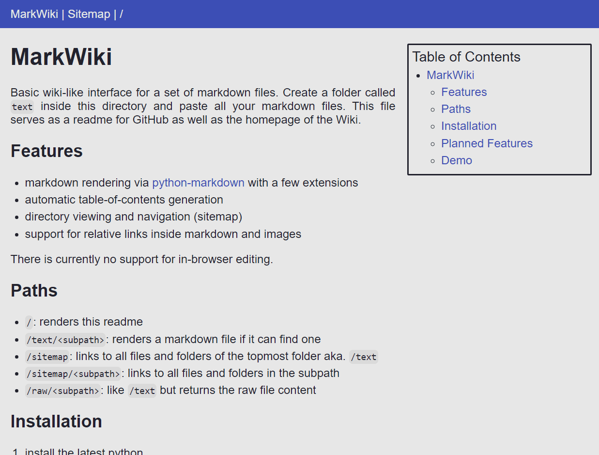

# MarkWiki
MarkWiki is a very simple single user wiki based on markdown. It is first and foremost a markdown renderer for a browser client but there's an opt-in feature to allow editing files in-browser as well. Though it isn't a complete system yet I hope to implement more small and simple features over time. 

## Features
- markdown rendering via [python-markdown](https://python-markdown.github.io/) with a few extensions
- automatic table-of-contents generation
- directory viewing and navigation (sitemap)
- support for relative links inside markdown and images
- make changes to files and save them back to disk. I highly recommend using version control to backup changes as the server doesn't handle backups yet. simply have a second git repo inside the `/text/` folder.

## Usage
MarkWiki primarily serves markdown files. Create a folder called `text` in this directory and paste all your markdown. You can edit files either in the browser by clicking the `edit` link or in your favourite text editor. MarkWiki doesn't cache files so a simple reload refreshes the browser view. Wiki-like page creation is supported. File deletion or account/permission management is currently not supported.

## Paths
- `/`: renders this readme
- `/text/<subpath>`: renders a markdown file if one can be found. if not we follow wiki-like behavior and prompt the user to create it.
- `/edit/<subpath>`: presents a textarea with the file content. POSTing to this path will write the changes to disk.
- `/sitemap/`: links to all files and folders of the topmost folder aka. `/text`
- `/sitemap/<subpath>/`: links to all files and folders in the subpath
- `/raw/<subpath>`: like `/text` but returns the raw file content

## Installation
1. install the latest python
2. install flask via `pip install flask`
3. install markdown via `pip install markdown`
4. run a developer server with `flask --app wikiserver run`

## Potential Future Features
- sidebar with newest and most recently changed files, possibly one of the following:
  - `/changes` route to see list of recently changed files
  - `/changes/<subpath>` route to see specific changes done to files
- some form of authentication or permission management, one of the following:
  - simple hardcoded passphrase when POSTing edits
  - less likely but maybe a more elaborate authentication system with reading/writing permissions

## Demo
This is how the interface looks:

